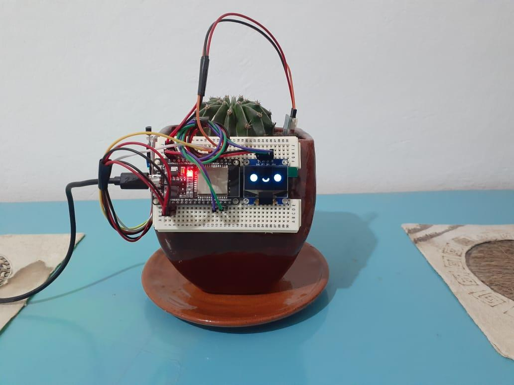
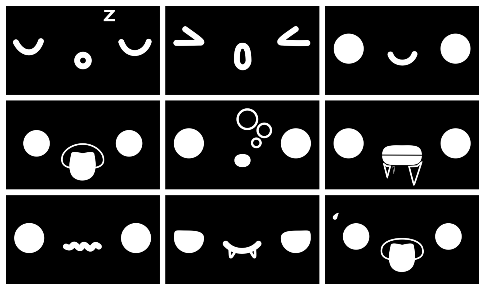
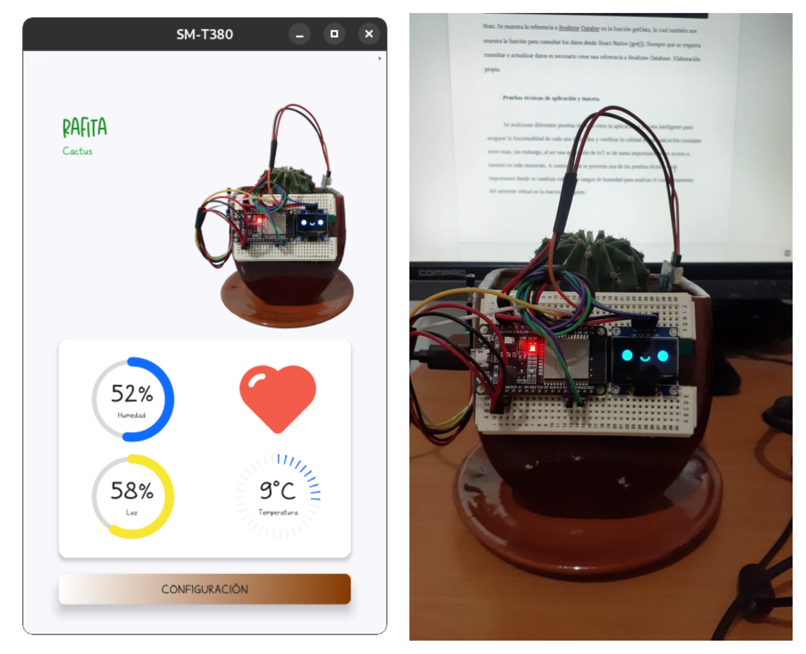
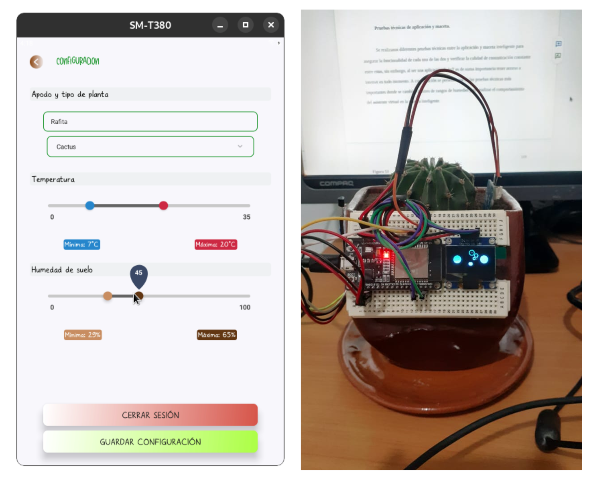
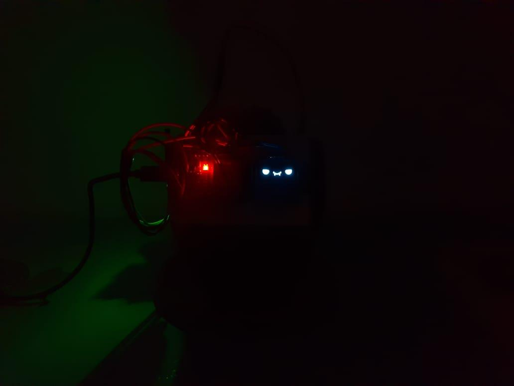

# ⚠️ About this project:

This is a final university project, possibly my tesis in the next monts of year 2023.

This project named Smart Planter applying Internet of Things (IoT), was made in order to solve situations of stress, anxiety and depression that a normal person may have, either by overwork, family situations and among others.

The main objective of this project is to create a positive psychological effect on stress, anxiety and depression for each of the users as a result of the current pandemic caused by SARS-CoV-2 and other situations such as home office, both at work and in education.

The objective is to turn your plant into a roommate and bring it to life through a virtual assistant. The methodology that was implemented was scrum, as it allows us to work more efficiently with previously defined steps in sprints. The development of the theoretical perspective will be based on the review of documentation obtained from the internet, consultation forums, and official IoT application development sites.

According to the project, it is concluded that technological development is a fundamental part to solve current problems, which also makes use of external branches of study, as in this case psychology is of utmost importance in the application of this project to generate positive effects on stress, anxiety and depression of people.

# 🧰 Material used:

- ESP32
- OLED Display 128x64 px
- LM35 Temperature Sensor
- Soil Moisture Sensor
- Sensor Photoresistor LDR

# 🎞️ Animations included:

 Animations

- Sleeping
- Wake up
- Happy
- Thirsty
- Choked
- Cold
- Unknown
- Vampire
- Hot

# ⚙️ Applying tests:

 Normal parameters.

 Modifying soil moisture parameter.

 Mode vampire.
